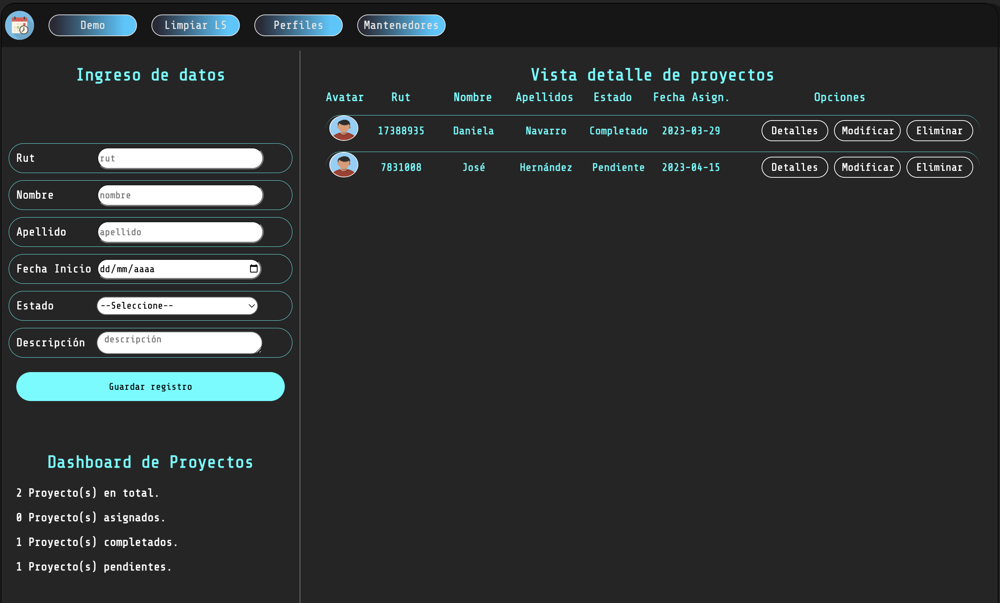
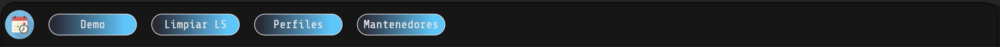

# Gestión de Proyectos - CRUD

### En esta App podrás asignar responsables, fechas y ver el estado y las descripciones de los distintos proyectos que tienes en tu portafolio, acá encontrarás una versión funcional de la misma: https://jhernandez84.github.io/crud/

### No podía faltar la modificación y eliminación de registros. Anímate a hacer un par de clics y te sorprenderás.

# ¿Que tal una demo?

### Si no quieres ingresar registros de prueba, te sugiero hacer clic en "Demo" y listo... verás como aparecen algunos registros cargados automáticamente. Lo demás es hacer clic y ver si cumple con lo que esperas.

# ¿Quieres probar tu mism@?

### En la sección "Ingreso de datos" podrás registrar tus propios proyectos y visualizarlos en la aplicación, carga la página cuantas veces quieras y podrás ver la información almacenada en LS.

### ¿Te aburriste o no quieres ocupar espacio innecesario? Puedes hacer clic en LimpiarLS y se limpiarán los datos.

# Quieres más detalle:

### Acá podrás ver el detalle de las tareas/proyectos asignados a cada responsable, un clic para desplegar el detalle. Ocultar resultará bastante intuitivo. 

# Nada mejor que un resumen!

### Información simple y precisa, en este pequeño dashboard podrás revisar el estado de los distintos proyectos que has ingresado:

# Responsive styles!

Obvio, no siempre ocupamos el PC de escritorio, por eso este diseño es full responsive y mostrará distintos layouts dependiendo de la pantalla en que estes utilizando la app.

Por supuesto que pantallas grandes verán todas las funcionalidades y pantallas más pequeñas verán tarjetas. a ti, ¿Cuál te gusta más?

#### Vista para pantallas <=1300px

 
#### Vista para pantallas de Ipad/Tablets

#### Vista para pantallas de Smartphones

